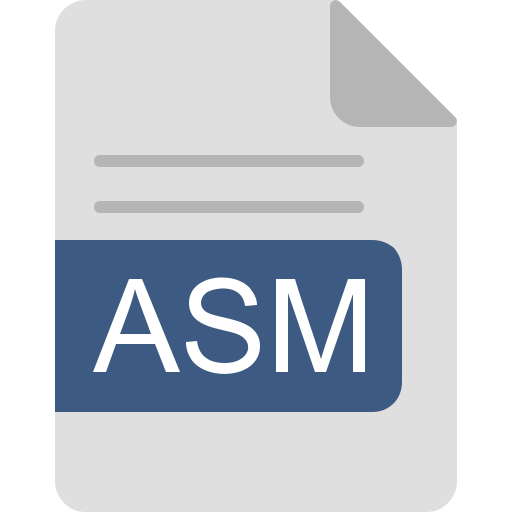

<h1 align="left">
    Hi , &nbsp; I'm Manon !
</h1>

- 🎓 PhD student in Electrical Engineering with a passion for ...
- 👩🏻‍🔬 Dynamic, meticulous, (extraordinary) curious, social and organized individual
- 👩🏻‍🤝‍👨🏼 Thrives on working as a team to tackle new problems and projects
- 🗣 Fluent in French, full professional proficiency in English and good knowledge of Dutch
- 💬 Favorite music:
> Angela by the Lumineers

<h1 align="left">
    Coding & Frameworks Skills
</h1>

    
    
    
    
    
    
    

  

    
    
    
    
    
    
    

> <a href="https://www.flaticon.com/free-icons/python" style="no" target="_blank" title="Icons">Flaticon</a>

<h1 align="left">
    Engineering Software & Usefull Skills
</h1>

    
    
    
    
    
    
    
    
    

